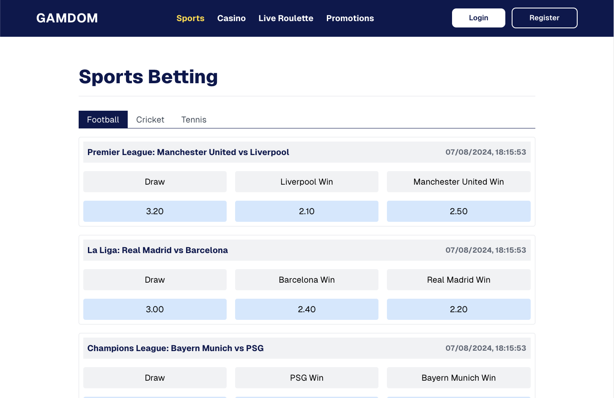

# Online Betting Dashboard

This project is a simple online betting dashboard that displays a list of sporting events, their corresponding odds, and allows users to place bets. It's built using Next.js frontend and Nest.js backend, organized in a NX monorepo.



## Future Improvements
Improvements that can be made to the project with more time:
- User authentication (check `TODOs` in the code)
- Add tests for the frontend and backend
- Setup pagination while fetching sports, events and bet history
- Better error handling and input validation
- Better UI/UX
- Caching

## Prerequisites

- Node.js (version 18 or later recommended)
- `npm` package manager
- PostgreSQL database

## Project Structure

This project is set up as an Nx monorepo with two main applications:

- `betting-client`: Next.js frontend application
- `betting-api`: Nest.js backend application

## Setup

### Clone the repository:
```bash
git clone https://github.com/abhishek-shaji/betting-platform.git
```
### Install dependencies:
```bash
npm ci
```
### Setup environment variables:
   - Create a `.env` file in the root of `apps/betting-api` and add the following environment variables:
     ```bash
     DATABASE_URL=postgres://<username>:<password>@localhost:5432/<database>
     ```
   - Create a `.env.local` file in the root of `apps/betting-client` and add the following environment variables:
     ```bash
     BACKEND_API_BASE_URL=http://localhost:4200
     NEXT_PUBLIC_CLIENT_BASE_URL=http://localhost:3000
      ```
### Seed the database:
```bash
nx run betting-api:seed
```

### Running the Application
#### Start the backend API:
```bash
nx run betting-api:serve:development
```
#### Start the frontend application:
```bash
nx run betting-client:dev
```

- The backend API should now be running on `http://localhost:4200` (or your configured port).
- The frontend application should be available at `http://localhost:3000` (or your configured port).

## Features

- Backend API endpoint to fetch sports events: `/api/events`
- Frontend dashboard displaying list of sports events
- Option to place bets on events
- Minimalistic design that uses Tailwind CSS
- Option to view bet history

## Technologies Used

- Frontend: Next.js, React, TypeScript
- Backend: Nest.js, Node.js, TypeScript
- Database: PostgreSQL
- Monorepo Tool: Nx
